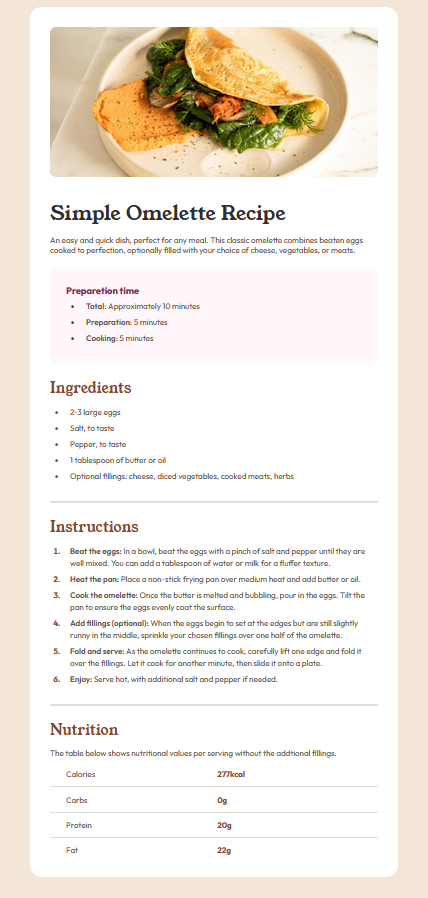
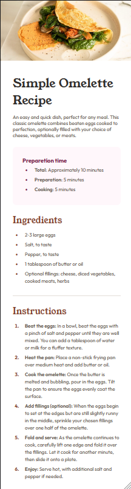

# Frontend Mentor - Recipe page solution

This is a solution to the [Frontend Mentor Recipe page challenge](https://www.frontendmentor.io/challenges/recipe-page-KiTsR8QQKm). Frontend Mentor challenges help you improve your coding skills by building realistic projects. 

## Table of contents

- [Overview](#overview)
  - [Screenshot](#screenshot)
  - [Links](#links)
- [My process](#my-process)
  - [Built with](#built-with)
  - [What I learned](#what-i-learned)
  - [Continued development](#continued-development)
  - [Useful resources](#useful-resources)
- [Author](#author)

## Overview
It is my second challange (newbie level) from Frontend Mentor. As a newcomer, I embraced the task of creating a Recipe page based on meticulously crafted Figma design file. My journey involved translating visual concepts into functional code, ensuring pixel-perfect alignment.

### Screenshot

### Links

- Solution URL: [GitHub](https://github.com/wojtekbrejnak/recipe-page_frontend-mentor)
- Live Site URL: [GitHub Pages](https://wojtekbrejnak.github.io/recipe-page_frontend-mentor)

## My process

- Project Planning: I started by reading the requerments on `Challange Hub` and downloading starter files and design Files.
- Setting Up Environment: I prefer using VS Code and it was everything I needed in this newbie project. 
- HTML Structure: I began by creating the basic HTML structure for my project. This included setting up the main HTML file, organizing elements, and creating semantic tags.
- CSS Styling: I used CSS to style my project. This involved creating layouts, applying colors, fonts.
- Figma Workflow: I used Figma design files to build more accurate solution (fonts, colors etc.).
- Version Control: I used Git for version control. It's my first Front-end mentor project and I made mistake by commiting completed project. 
- Documentation: Documenting everything is crucial when working as Developer so I created this file with great attention hoping that it will be helpful for future reference and sharing with others.

### Built with

- HTML5
- CSS

### What I learned

I acquired proficiency in the fundamentals of HTML, CSS, and working with Figma files. This knowledge has been invaluable for my project development.

### Continued development

As I continue to learn to become a Junior Front-end Developer, I plan to explore the following areas:

- JavaScript Integration: Incorporating JavaScript functionality to enhance user interactions and dynamic content.
- Responsive Design: Ensuring my web application looks great on various devices and screen sizes.
- Version Control: Learning more about Git and GitHub and using it effectively for collaborative development.
- Testing and Debugging: Improving my skills in identifying and fixing issues in my code.
- Deployment: Deploying my project to a live server for public access.

### Useful resources

- [MDN](https://developer.mozilla.org/en-US/docs/Learn) - This is the number one resource for every developer. I frequently refer to it for comprehensive and up-to-date information.
- [The Odin Project](https://www.theodinproject.com/) - An incredible open-source coding education resource. Its hands-on approach empowers you to build things from scratch right from the beginning.

## Author

- GitHub - [wojtekbrejnak](https://www.github.com/wojtekbrejnak)
- Frontend Mentor - [@wojtekbrejnak](https://www.frontendmentor.io/profile/wojtekbrejnak)
- Twitter - [@wojtekbrejnak](https://www.twitter.com/wojtekbrejnak)